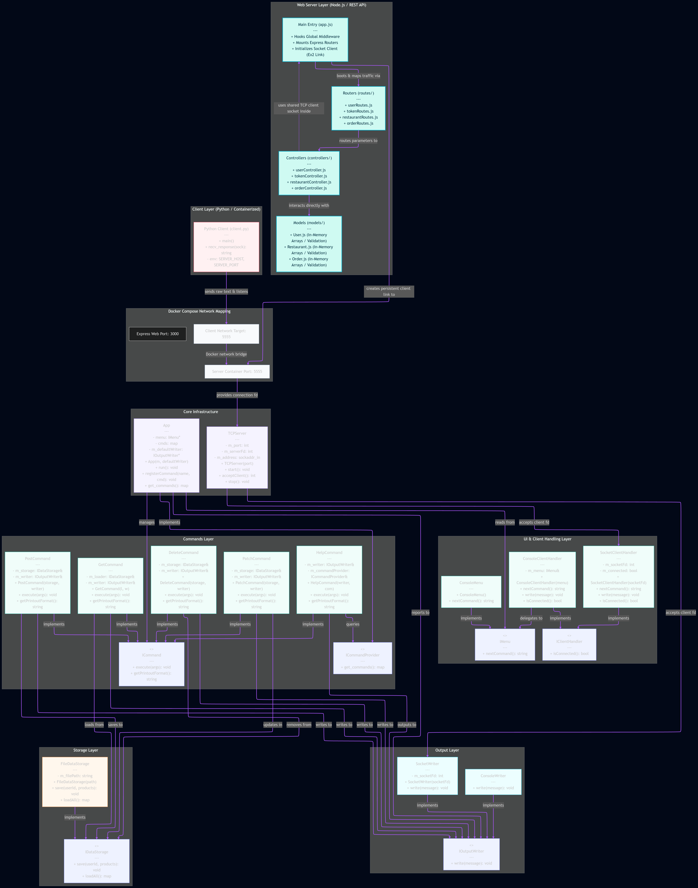
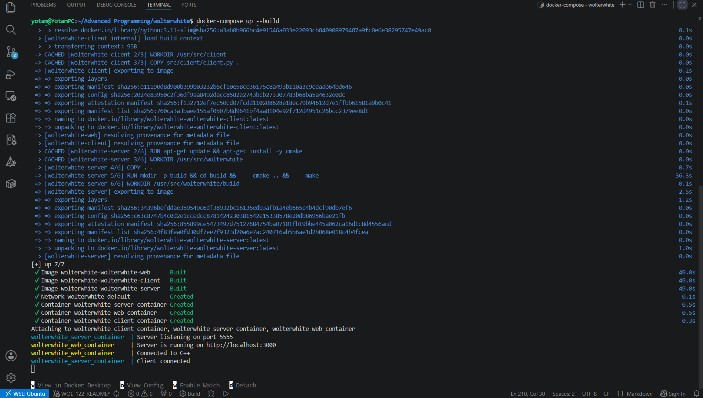
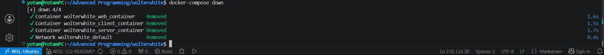

# 📘 WOLTerWhite 📘

This is the updated README for the **WOLTerWhite** TCP client-server project.

---

## 👥 Authors

- 👨‍💻 [Tal Tkhonov](https://github.com/TalTikho)
- 👨‍💻 [Yotam Harari Lifshits](https://github.com/yhtl350)
- 👨‍💻 [Liam Homay](https://github.com/LiamHomay)

---

## 🔗 Links

- 🗺️ [UML Diagram](https://tinyurl.com/UMLinkMe)



---

## 🌿 Branch Strategy (finished exercises go this way)

| Branch | Exercise | Description |
| -------- | ---------- | ------------- |
| `finished-ex1` | Exercise 1 | CLI recommendation system |
| `finished-ex2` | Exercise 2 | TCP client-server system |
| `finished-ex3` | Exercise 3 | web server (current) |

> ⚠️ **NOTE**: Do not modify `finished-ex1` or `finished-ex2` or `finished-ex3` branches after submission
> to preserve grace days.

---

## 🏗️ Project Overview

WOLTerWhite is a TCP-based client-server recommendation system.

The project is divided into three main components:

- **Exercise 1** — CLI product recommendation system in C++
- **Exercise 2** — TCP client-server architecture (C++ server + Python client)
- **Exercise 3** — RESTful web server in Node.js/Express (MVC)
  that connects to the Exercise 2 C++ server for recommendations

| Service | Technology | Role |
| --------- | ------------ | ------ |
| 🖥️ C++ TCP Server | C++17 | Business logic, recommendations, data persistence |
| 🌐 Node.js Web Server | Node.js + Express | REST API, MVC architecture |
| 🐍 Python Client | Python 3 (Exercise 2) | Interactive console client for the C++ server |

---

## ⚙️ Tech Stack

| Layer | Technology |
| ------- | ------------ |
| Web Server | Node.js + Express |
| TCP Server | C++17 |
| Client | Python 3 |
| Build System | CMake |
| Containerization | Docker + Docker Compose |
| Communication | TCP Sockets + HTTP REST |

---

## ✨ Features

### Web Server (Exercise 3)

- Full RESTful API (MVC architecture)
- User registration and login
- Restaurant management (CRUD)
- Product/menu management (CRUD)
- Order management (CRUD)
- Search across restaurants and products
- Connects to C++ server for product view tracking and recommendations
- In-memory data storage (resets on restart)

### C++ TCP Server (Exercise 2)

- POST command — create new user
- PATCH command — add products to existing user
- DELETE command — remove products from user
- GET command — recommend products based on similar users
- HELP command — display all supported commands
- Persistent TCP connection
- File-based data persistence

---

## 📂 Project Structure

```text
.
├── src/
│   ├── client/
│   ├── include/
│   ├── source/
│   │   ├── commands/
│   │   ├── server/
│   │   ├── storage/
│   │   ├── ui/
│   │   ├── App.cpp
│   │   └── main.cpp
│
├── data/
│
├── tests/
├── webServer/                  
│   ├── controllers/            
│   │   ├── authController.js
│   │   ├── orderController.js
│   │   ├── productController.js
│   │   ├── restaurantController.js
│   │   ├── searchController.js
│   │   └── userController.js
│   ├── models/                 
│   │   ├── orderModel.js
│   │   ├── productModel.js
│   │   ├── restaurantModel.js
│   │   └── userModel.js
│   ├── routes/                 
│   │   ├── authRoutes.js
│   │   ├── orderRoutes.js
│   │   ├── productRoutes.js
│   │   ├── restaurantRoutes.js
│   │   ├── searchRoutes.js
│   │   └── userRoutes.js
│   ├── views/                  
│   ├── cppClient.js            
│   ├── app.js                  
│   └── package.json
│
├── docker-compose.yml
├── Dockerfile
├── Dockerfile.client
├── CMakeLists.txt
├── .gitignore
└── README.md
````

---

## 🛠️ How To Run

### 🐳 Docker Setup

#### 1️⃣ Make sure that you have **Docker Desktop** on your machine, and clone the repository. Then

```bash
git clone https://github.com/TalTikho/wolterwhite
cd wolterwhite
```

> ⚠️ **NOTE**: Please make sure **Docker Desktop** is running.

---

#### 2️⃣ Build and Start the System

```bash
docker-compose up --build 
```

This starts three containers:

| Container | Service | Port |
| ----------- | --------- | ------ |
| `wolterwhite_server_container` | C++ TCP server | 5555 |
| `wolterwhite_web_container` | Node.js backend server | 5000 |
| `wolterwhite_client_container` | Python client | — |
| `wolterwhite-front` | React.js frontend server | 3000 |


---

#### 3️⃣ Use the React site

After building everything with 
```bash
docker-compose up --build 
```
just command:
 ```bash
docker-compose up 
```
and navigate to [WolterWhite](http://localhost:3000)
 and 
start your journey.


---

#### 3️⃣ Use the Web Server API

The REST API is available at `http://localhost:5000`.

Example using curl:

```bash
# Get all restaurants
curl -i http://localhost:5000/api/restaurants

# Register a new user
curl -i -X POST http://localhost:5000/api/users 
  -H "Content-Type: application/json" 
  -d '{"username":"john","name":"John Smith","phone":"050-1234567","address":"Tel Aviv","password":"1234"}'

# Login
curl -i -X POST http://localhost:5000/api/tokens 
  -H "Content-Type: application/json" 
  -d '{"username":"john","password":"1234"}'
```

---

#### 5️⃣ Stop Everything

```bash
docker-compose down
```

This shuts down all running containers.

---

#### 5️⃣ Starting and Closing




---

## 📡 REST API Reference

All `/api/` endpoints return JSON.
Protected endpoints require authentication.

---

## 📜 Supported Commands

### 👤 Users

| Method | Endpoint | Auth | Description |
| -------- | ---------- | ------ | ------------- |
| POST | `/api/users` | ❌ | Register new user |
| GET | `/api/users/:id` | ✅ | Get user details |

### Register — `POST /api/users`

```bash
curl -i -X POST http://localhost:3000/api/users 
  -H "Content-Type: application/json" 
  -d '{
    "username": "john",
    "name": "John Smith",
    "phone": "050-1234567",
    "address": "Tel Aviv",
    "password": "1234"
  }'

```

---

## 🔐 Authentication

| Method | Endpoint | Auth | Description |
| -------- | ---------- | ------ | ------------- |
| POST | `/api/tokens` | ❌ | Login, returns token |

### Login — `POST /api/tokens`

```bash
curl -i -X POST http://localhost:3000/api/tokens 
  -H "Content-Type: application/json" 
  -d '{"username":"john","password":"1234"}'
```

```json
{ "token": "abc1sdfsfds23" }
```

> ⚠️ **NOTE**: Use the returned `token` as the token in subsequent requests.

---

## 🍽️ Restaurants

| Method | Endpoint | Auth | Description |
| -------- | ---------- | ------ | ------------- |
| GET | `/api/restaurants` | ❌ | Get all restaurants |
| POST | `/api/restaurants` | ❌ | Create restaurant |
| GET | `/api/restaurants/:id` | ❌ | Get restaurant by ID |
| PATCH | `/api/restaurants/:id` | ❌ | Update restaurant |
| DELETE | `/api/restaurants/:id` | ❌ | Delete restaurant |

### Create Restaurant — `POST /api/restaurants`

```bash
curl -i -X POST http://localhost:3000/api/restaurants
  -H "Content-Type: application/json"
  -d '{"name":"Pizza Palace","address":"Dizengoff 1","cuisine":"Italian"}'
```

---

## 🍕 Products (Menu)

| Method | Endpoint | Auth | Description |
| -------- | ---------- | ------ | ------------ |
| GET | `/api/restaurants/:id/products` | ❌ | Get all products |
| POST | `/api/restaurants/:id/products` | ❌ | Add product to menu |
| GET | `/api/restaurants/:id/products/:pId` | ✅ | Get product + record view |
| PATCH | `/api/restaurants/:id/products/:pId` | ❌ | Update product |
| DELETE | `/api/restaurants/:id/products/:pId` | ❌ | Delete product |

> ⚠️ **NOTE**: `GET /api/restaurants/:id/products/:pId` records the product
> view in the C++ recommendation server when `x-user-id` is provided.

---

## 📦 Orders

All order endpoints require authentication (`x-user-id` header).

| Method | Endpoint | Auth | Description |
| -------- | ---------- | ------ | ------------- |
| POST | `/api/orders` | ✅ | Create new order |
| GET | `/api/orders` | ✅ | Get user's orders |
| GET | `/api/orders/:id` | ✅ | Get order details |
| PATCH | `/api/orders/:id` | ✅ | Update order |
| DELETE | `/api/orders/:id` | ✅ | Delete order |

### Create Order — `POST /api/orders`

```bash
curl -i -X POST http://localhost:3000/api/orders 
  -H "Content-Type: application/json" 
  -H "x-user-id: abc123" 
  -d '{
    "restaurantId": "rest-id-here",
    "products": ["prod-id-1", "prod-id-2"]
  }'
```

---

## 🔍 Search

| Method | Endpoint | Auth | Description |
| -------- | ---------- | ------ | ------------- |
| GET | `/api/search/:query` | ❌ | Search restaurants + products |

### Search — `GET /api/search/pizza`

```bash
curl -i http://localhost:3000/api/search/pizza
```

```json
{
  "restaurants": [{ "id": "...", "name": "Pizza Palace" }],
  "products":    [{ "id": "...", "name": "Pepperoni Pizza" }]
}
```

---

## 📜 C++ TCP Server Commands (ex2 server)

Used indirectly via cppClient.js 

| Command | Description | Response |
| --------- | ------------- | ---------- |
| `POST [userid] [pid1] [pid2]...` | Create a userID row + adds viewed products' ids | `201 Created` |
| `PATCH [userid] [pid1] [pid2]...` | Adds viewed products' ids to existing user | `204 No Content` |
| `DELETE [userid] [pid1] [pid2]...` | Removes viewed products' ids from user | `204 No Content` |

### Error Responses

| Response | Meaning |
| ---------- | --------- |
| `400 Bad Request` | Invalid or malformed command |
| `404 Not Found` | Valid command but data doesn't exist |

---

## 🔗 Web Server ↔ C++ Server Connection

- The Node.js web server connects to the C++ TCP server on startup
using a **persistent TCP socket** via `cppClient.js`

---

## ⚠️ Error Handling

### Web Server (HTTP)

| Status | Meaning |
| -------- | --------- |
| 200 OK | Success with body |
| 201 Created | Resource created + Location header |
| 204 No Content | Success without body |
| 400 Bad Request | Missing or invalid fields |
| 401 Unauthorized | Missing x-user-id header |
| 403 Forbidden | Authenticated but accessing another user's resource |
| 404 Not Found | Resource not found |
| 409 Conflict | Conflict with existing data, for instance name conflict|

### C++ TCP Server

| Response | Meaning |
| ---------- | --------- |
| `400 Bad Request` | Invalid command format |
| `404 Not Found` | Logically invalid request |

---

## 🧪 Testing 

Run the tests found in [`test.http`](./webServer/test.http)


## 📝 Implementation Notes

- The Node.js web server stores all data **in-memory** - restarting
  the web server clears all users, restaurants, products and orders
- The C++ server stores data in the `data/` directory  - persists
  across restarts
- The Python client is intentionally lightweight ("dumb client") -
  it sends whatever the user types directly to the C++ server (ex2)
- The TCP connection from the web server to the C++ server is
  persistent - opened once on startup and reused for all requests
- `node_modules/` is excluded from the repository via `.gitignore`
- The system follows SOLID principles and loose coupling throughout

## 📄 License

- This project was developed as part of an advanced systems programming assignment
