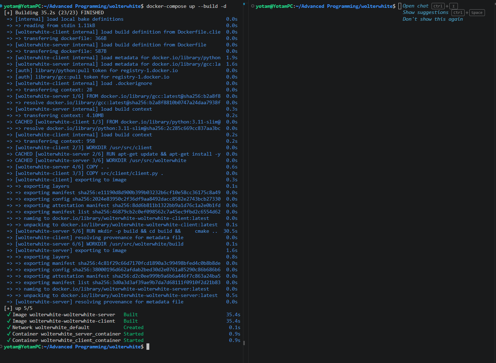
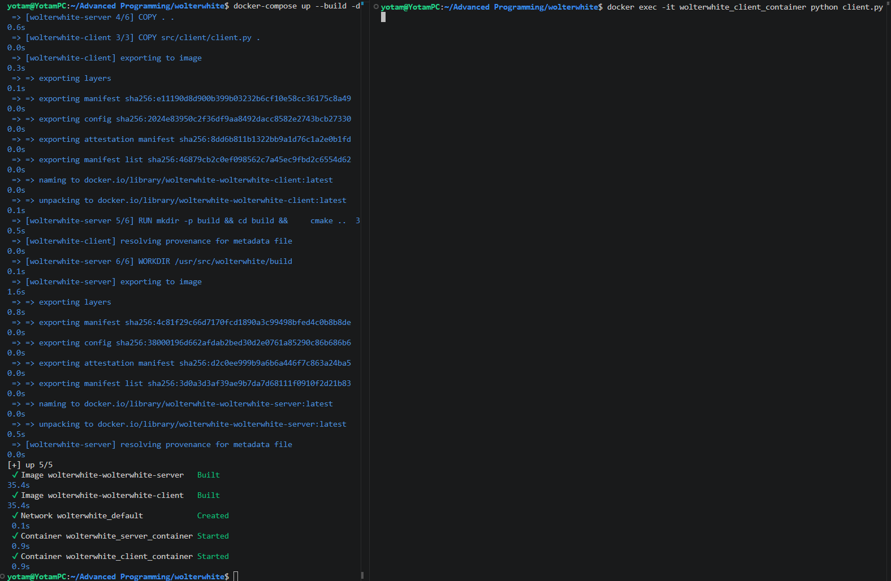
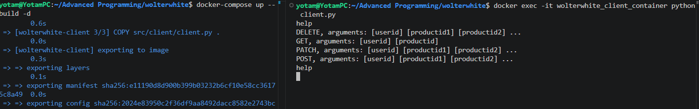
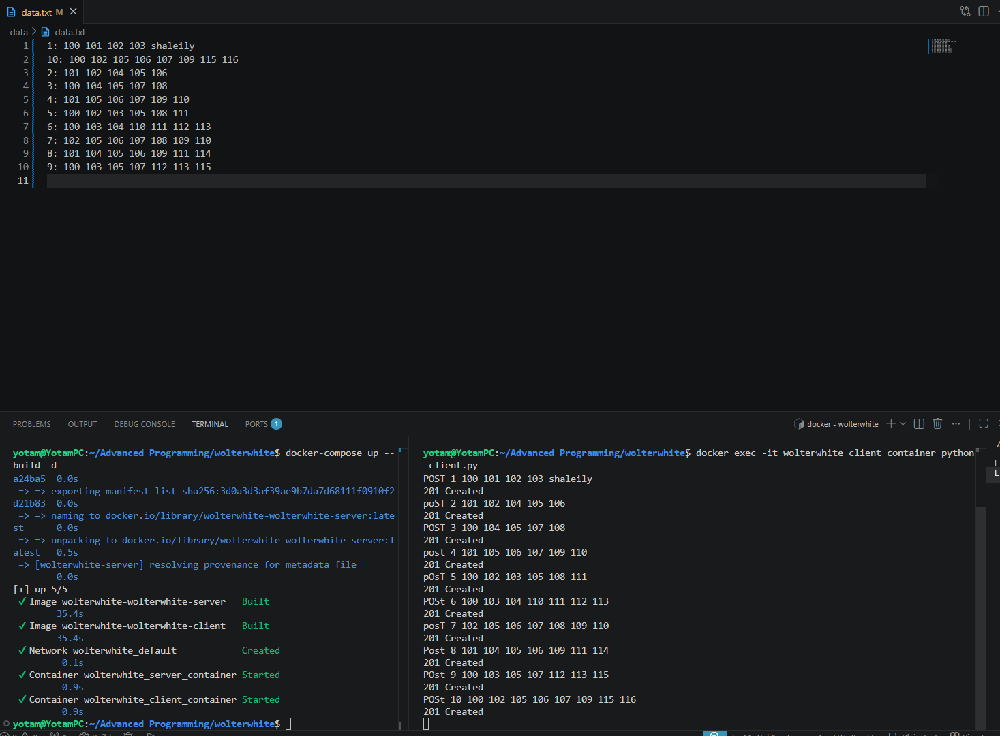
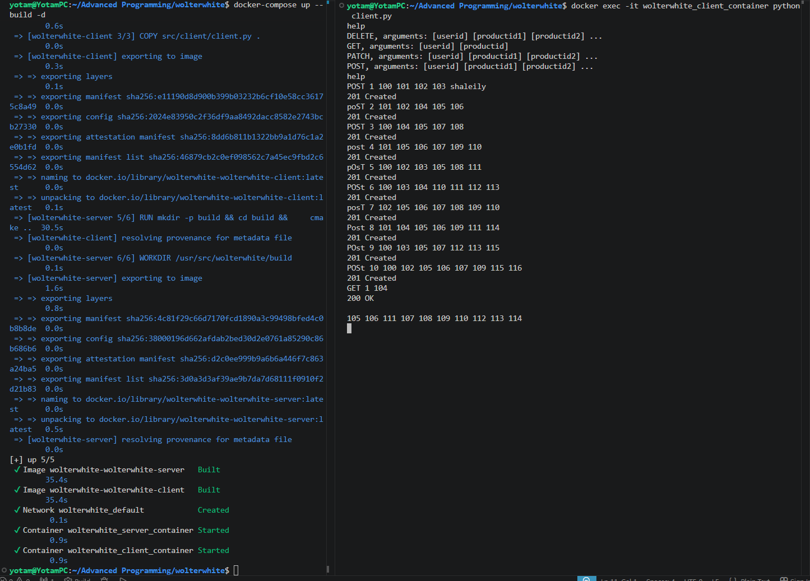
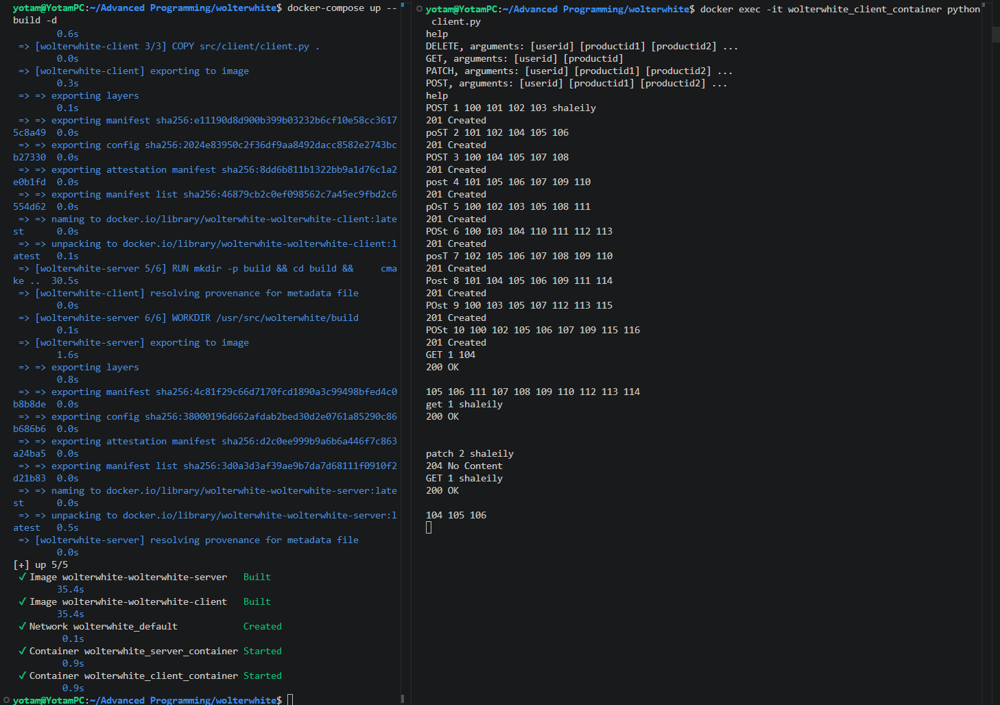
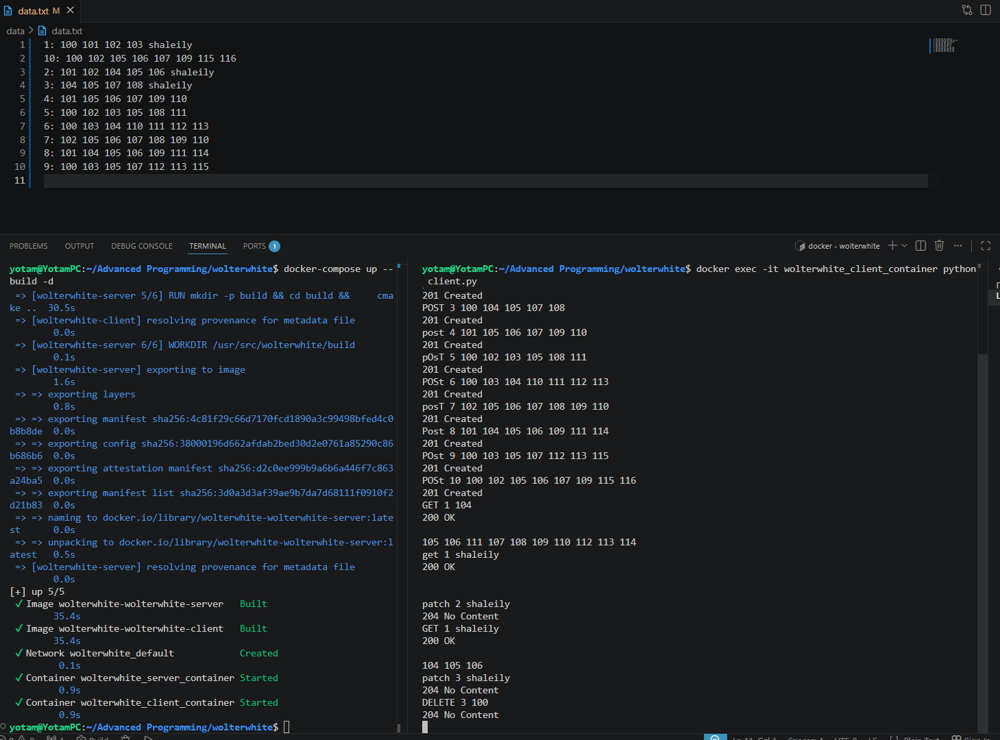
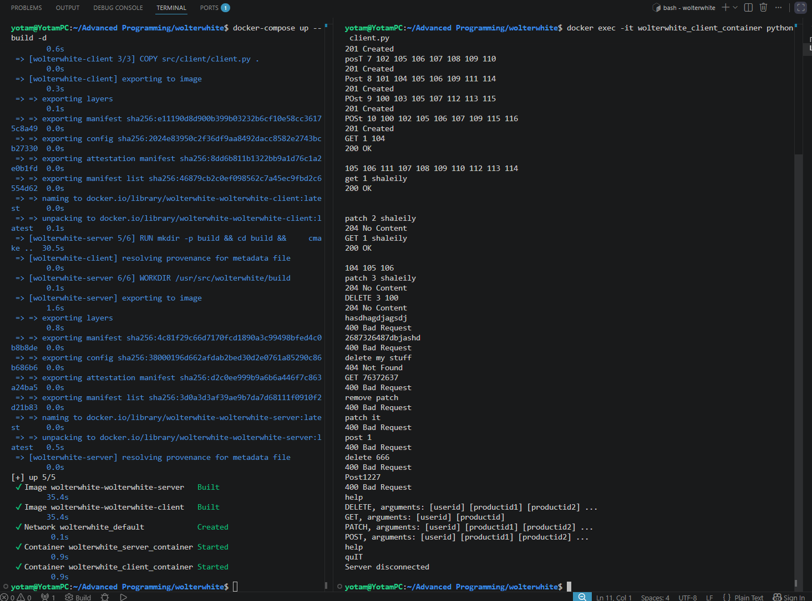
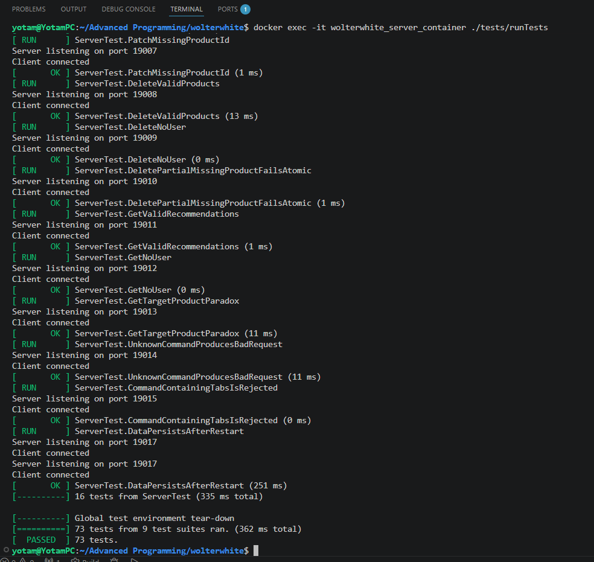

# 📘 WOLTerWhite 📘

This is the updated README for the **WOLTerWhite** TCP client-server project.

---

## 👥 Authors

- 👨‍💻 [Tal Tkhonov](https://github.com/TalTikho)
- 👨‍💻 [Yotam Harari Lifshits](https://github.com/yhtl350)
- 👨‍💻 [Liam Homay](https://github.com/LiamHomay)

---

## 🔗 Links

- 🗺️ [UML Diagram](https://tinyurl.com/3cny4kdd)


---

# 🏗️ Project Overview

WOLTerWhite is a TCP-based client-server recommendation system.

The project is divided into two main components:

- 🖥️ **C++ TCP Server**
- 🐍 **Python TCP Client**

The server handles all business logic, data management, and recommendation calculations.  
The client provides an interactive console interface that communicates with the server over a persistent TCP connection.

---

# ⚙️ Tech Stack

- ©️ C++
- 🐍 Python 3
- 🛠️ CMake
- 🐳 Docker
- 🌐 TCP Sockets

---

# ✨ Features

- POST command (create new user)
- PATCH command (add products to an existing user)
- DELETE command (remove products from user)
- GET command (recommend products)
- HELP command (display all supported commands)
- Persistent TCP connection
- Dockerized deployment 🐳
- Automated tests 🧪

---

# 📂 Project Structure

```text
.
├── src/
│   ├── client/
│   ├── include/
│   ├── source/
│   │   ├── commands/
│   │   ├── server/
│   │   ├── storage/
│   │   ├── ui/
│   │   ├── App.cpp
│   │   └── main.cpp
│
├── data/
│
├── tests/
│
├── docker-compose.yml
├── Dockerfile
├── Dockerfile.client
├── CMakeLists.txt
├── .gitignore
└── README.md
````

---

# 🛠️ How To Run

# 🐳 Docker Setup

## 1️⃣ Make sure that you have **Docker Desktop** on your machine, and clone the repository. Then:

```bash
git clone https://github.com/TalTikho/wolterwhite
cd wolterwhite
```

> ⚠️ **NOTE**: Please make sure **Docker Desktop** is running.

---

## 2️⃣ Build and Start the System

```bash
docker-compose up --build -d
```

This will start:

* C++ TCP server container
* Python client container

---

## 3️⃣ Run the Client (Interactive)

```bash
docker exec -it wolterwhite_client_container python client.py
```

The client connects automatically to the server using TCP.

> ⚠️ **NOTE**: Please make sure the client is running in a Separate Terminal.

> ⚠️ **NOTE**: To stop a run without closing the docker and rebuilding the  client can write "quit" in any letter case.

---

## 4️⃣ Run Tests

```bash
docker exec -it wolterwhite_server_container ./tests/runTests
```

This runs the full automated test suite.

---

## 5️⃣ Stop Everything

```bash
docker-compose down
```

This shuts down all running containers.

---

# 🌐 TCP Client-Server Flow

1. The server starts and listens on a TCP port.
2. The client connects to the server using the server IP and port.
3. The user enters commands in the client console.
4. The client sends commands to the server through the TCP socket.
5. The server processes the request.
6. The server sends a response back to the client.
7. The client prints the response to the console.

The same TCP connection remains active during the entire session.

---

# 📜 Supported Commands

## ➕ POST

Creates a new user.

```text
POST [userid] [productid1] [productid2] ...
```

### Response

```text
201 Created
```

---

## 🔄 PATCH

Updates an existing user.

```text
PATCH [userid] [productid1] [productid2] ...
```

### Response

```text
204 No Content
```

---

## ❌ DELETE

Deletes products from a user.

```text
DELETE [userid] [productid1] [productid2] ...
```

### Response

```text
204 No Content
```

---

## 🎯 GET

Returns recommendations for a user.

```text
GET [userid] [productid]
```

### Response

```text
200 Ok

[recommendation output]
```

---

## ❓ HELP

Displays all supported commands.

```text
HELP
```

---

# ⚠️ Error Handling

## Invalid Command

```text
400 Bad Request
```

Returned when:

* The command format is invalid
* Unknown commands are sent
* Invalid arguments are provided

---

## Logical/Data Errors

```text
404 Not Found
```

Returned when:

* The command is syntactically valid but logically invalid

---

# 🧪 Testing

The project includes automated tests for:

* Application flow
* TCP server behavior
* Command handling
* POST command
* PATCH command
* DELETE command
* GET command
* HELP command
* Menu system
* Storage system
* Invalid inputs
* Edge cases

---

# 📝 Implementation Notes

* The server handles all business logic.
* The Python client is intentionally lightweight ("dumb client").
* The TCP connection remains persistent throughout the session.
* The server supports one client at a time.
* Input/output is performed exclusively through TCP sockets.
* The system follows SOLID principles and loose coupling architecture.
* Data is stored inside the `/data` directory.

---

# 📸 Example Runs

## Starting the Environment



---

## Running the Client and Triggering HelpCommand





---

## Running Example Commands



---

## GET Recommendation Example






---

## DELETE / PATCH Example




---

## Invalid Input  + help + weird working quit prompt Example 



---

## Tests Passing




---

# ✅ Design Principles

* Clean and modular code
* Separation between `.h` and `.cpp`
* Loose coupling
* SOLID principles
* Extensible architecture
* Maintainable folder structure
* Fully containerized environment

---

# Answered Questions

1. Did changing the names of the commands require touching "closed code to changes but open to expansion"?

    No, We only needed to extend our code adding a 
    ```c 
    const std:: string getPrintoutFormat ();
    ```
    method to each command letting help get its print orders with the updated name.

2. Did adding new commands require touching "closed code to changes but open to expansion"?

    No, when implementing POST and PATCH we relied on previous AddCommand while reserving its functionality only adding neccessary logic. 
    
    In addition, DELETE is a whole new command; It required some changes to file handling because before we were only adding to a file, not removing data from it - this is an expansion rather than change of closed code logic.
    
    Moreover, Help was only expanded to match new commands list (and the new criterium of alphabetical order of output).
   

3. Did changing the output destination require touching "closed code"?

4. Did changing the input/output to sockets require touching "closed code"?

    **We will answer both of the above queries in a unified answer down here**

    No, in ex2 we needed to change the input/output sources from cin/cout to sockets. Therefore, In `ICommand.h` we needed `execute()`
    to return `string` and not `void`, so we created `IOutputWriter`.


    `IOutputWriter` is now in every command's constructor (next to storage). `IOutputWriter` can now be `SocketWriter`. Next to it `ClientHandler` can be any menu including `SocketMenu` as it inherits both `IMenu` and `IOutputWriter` able to write the next command to a socket in similar fashion to ex1's `ConsoleMenu`. 

    Therefore, the code was only extended and the same flow can be run without the commands "knowing" the type of source/destination and closed code like old interfaces being overrun.


---

# 📄 License

This project was developed as part of an academic systems programming assignment.