# 📘 WOLTerWhite

WOLTerWhite is an Advanced Programming course project that seamlessly connects a **React web dashboard** and a **React Native mobile app** to a high-performance **C++ algorithmic recommendation engine** via a **Node.js/Express REST API gateway**.

> 📖 **Graders:** See the [`wiki/`](./wiki) folder for step-by-step walkthroughs — environment startup, login flows, and full CRUD verification across web and mobile. Also - the Project is on WSL and the emulator is on windows

---

## 👥 Authors

| Name | GitHub |
| ------ | -------- |
| Tal Tkhonov | [@TalTikho](https://github.com/TalTikho) |
| Yotam Harari Lifshits | [@yhtl350](https://github.com/yhtl350) |
| Liam Homay | [@LiamHomay](https://github.com/LiamHomay) |

---

## 🌿 Project Milestones

| Branch | Exercise | Description |
| -------- | ---------- | ------------- |
| `finished-ex1` | Exercise 1 | CLI recommendation system (C++ core) |
| `finished-ex2` | Exercise 2 | TCP client-server system (C++ & Python) |
| `finished-ex3` | Exercise 3 | Node.js/Express API gateway (MVC) |
| `finished-ex4` | Exercise 4 | React web frontend with Context & JWT auth |
| `finished-ex5` | Exercise 5 | React native mobile app (Expo) |
| `main` | - | - |

> ⚠️ Do not modify `finished-ex1` through `finished-ex5` branches after submission.

---

## 🏗️ System Architecture

``` bash
┌─────────────────────┐     ┌─────────────────────┐
│   React Web App     │     │  React Native App   │
│   (port 3000)       │     │  (Expo / Android)   │
└──────────┬──────────┘     └──────────┬──────────┘
           │                           │
           └─────────────┬─────────────┘
                         ▼
            ┌────────────────────────┐
            │  Node.js/Express       │
            │  REST API Gateway      │
            │  (port 5000)           │
            └────────────┬───────────┘
                         ▼
            ┌────────────────────────┐
            │  C++ TCP Server        │
            │  Recommendation Engine │
            └────────────────────────┘
```

1. **React Web Frontend** (`/frontend`) — Interactive dashboard with auth, restaurant browsing, ordering, admin controls, dark/light theme, and live polling.

2. **React Native Mobile App** (`/mobile`) — Cross-platform Expo app mirroring all core web flows with drawer + tab navigation.
3. **Node.js REST API** (`/webServer`) — MVC gateway handling JWT auth, in-memory data store, and TCP bridge to the C++ engine.
4. **C++ Core** (`/src`) — High-performance recommendation engine with persistent disk I/O and custom command dispatch.

---

## 📂 Directory Structure

``` bash
.
├── src/                  # 🖥️ C++ Engine
│   ├── include/          # Header declarations
│   └── source/           # Core algorithm implementations
│
├── webServer/            # 🌐 Node.js/Express REST API (MVC)
│   ├── controllers/      # Auth, Restaurants, Orders logic
│   ├── models/           # In-memory entity schemas
│   ├── routes/           # Express REST endpoints
│   └── cppClient.js      # Persistent TCP socket to C++ server
│
├── frontend/             # 🎨 React Web Application
│   └── src/
│       ├── components/   # Navbar, Cards, modals
│       ├── context/      # AuthContext, ThemeContext, FilterContext
│       ├── hooks/        # useSound and other custom hooks
│       ├── pages/        # Home, Login, Orders, Restaurant
│       └── services/     # API layer
│
├── mobile/               # 📱 React Native / Expo App
│   ├── app/
│   │   ├── (drawer)/     # Drawer navigator
│   │   │   └── (tabs)/   # Tab navigator (Home, My Orders)
│   │   └── login.tsx
│   ├── components/       # RestaurantCard, ProductCard, SideMenu
│   ├── context/          # Auth, Theme, Filter contexts
│   ├── styles/           # StyleSheet definitions (themed)
│   └── services/         # api.ts + apiConfig.ts
│
├── wiki/                 # 📖 Grader documentation
│   ├── environment-startup.md
│   ├── login-registration.md
│   └── crud-walkthrough.md
│
├── data/                 # 💾 C++ persistent output volume
├── docker-compose.yml    # Multi-container orchestration
├── CMakeLists.txt        # C++ build config
└── README.md
```

---

## 🚀 Quick Start

### Step 1 — Web + Backend (Docker)

```bash
git clone https://github.com/TalTikho/wolterwhite
cd wolterwhite
docker-compose up --build
```

| Service       | URL                     |
| ------------- | ----------------------- |
| Web Frontend  | `http://localhost:3000` |
| REST API      | `http://localhost:5000` |

### Step 2 — Mobile App (Android Emulator)

> 💡 **Why not Docker for mobile?** The Android emulator communicates with Metro bundler via `10.0.2.2` (host machine). Running Metro inside Docker breaks this bridge and requires complex ADB port forwarding — so the mobile app runs directly on the host instead.

**First, create the required API config file** (excluded from repo via `.gitignore`):

Create `mobile/services/apiConfig.ts` with this content:

```typescript
import { Platform } from 'react-native';

export const API_BASE_URL = Platform.select({
  android: 'http://10.0.2.2:5000',
  ios: 'http://localhost:5000',
  default: 'http://localhost:5000',
});
```

Then in a new terminal:

```bash
cd mobile
npm install
npx expo start -c --tunnel
```

> ⚠️ Note that you opened your emulatorand it should be running beforehand. Press `a` in the Expo CLI to open the Android emulator, or scan the QR code with Expo Go on a physical device.

>⚠️ To shut down: press `Ctrl+C` in each terminal, then run `docker-compose down`.

---

## 📝 Technical Highlights

- **JWT Auth:** Token-based authentication across all clients. Web stores in React Context; mobile stores in AsyncStorage. Automatic logout on 401.
- **Live Polling:** Web frontend polls the API at intervals to sync new restaurant/product additions without page reloads.
- **Theming:** Full dark/light mode on both web (CSS variables) and mobile (StyleSheet functions with a shared color system).
- **C++ Bridge:** Node.js maintains a persistent TCP socket to the C++ engine for recommendation queries.
- **SOLID Design:** All modules follow single-responsibility and dependency-inversion principles throughout.

---

### ⏯️ Screenshots

#### Web Showcase Section

- Home Page — Admin Login:
    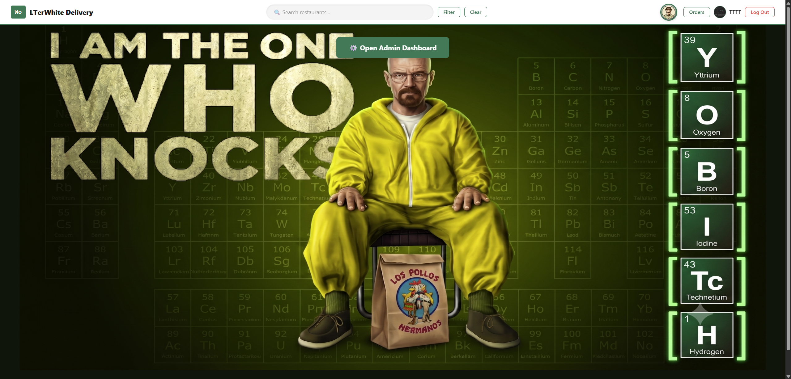

- Admin Panel:
    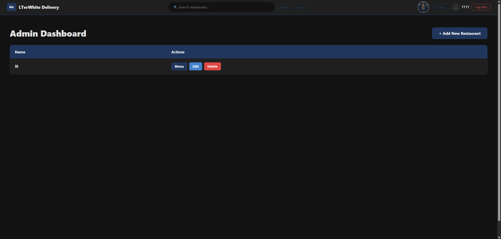

- Home Page with Restaurants:
    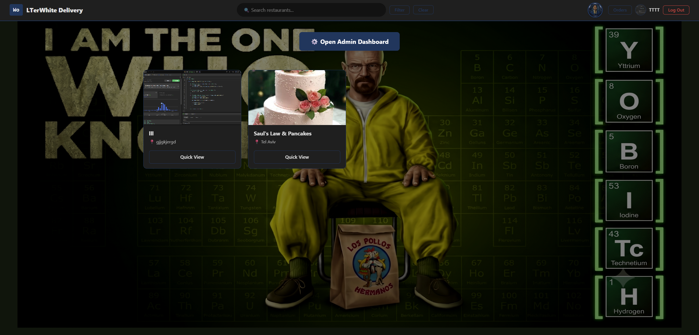

- Regular User Home Dashboard:
    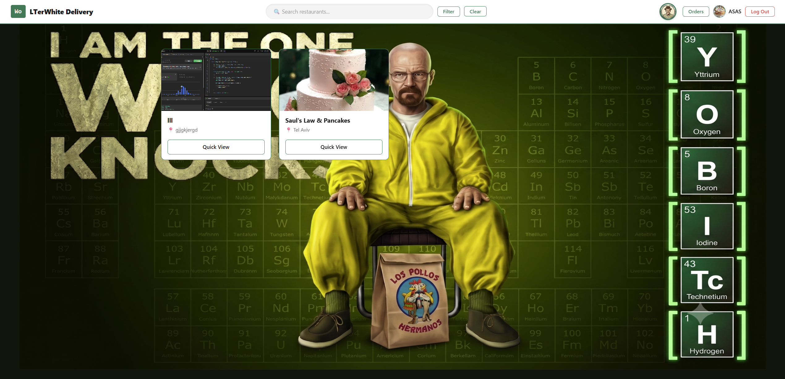

#### Mobile (Green Text Files) Showcase Section

- Admin Home Page (Clear View):
    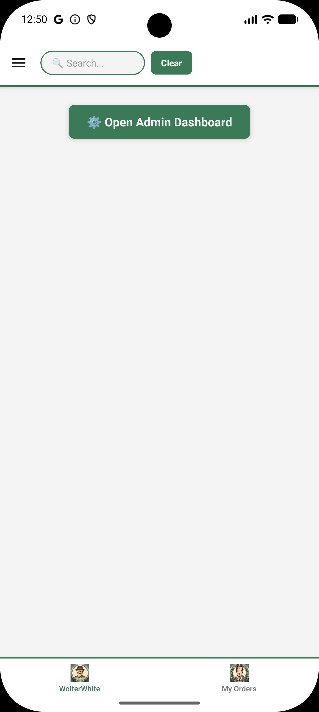

- Admin Home Page with Content:
    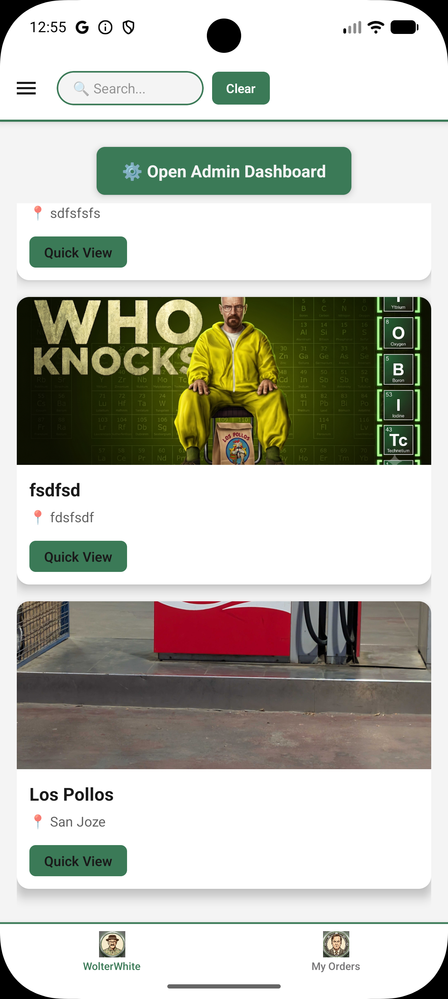

- Mobile Restaurant Admin Management:
    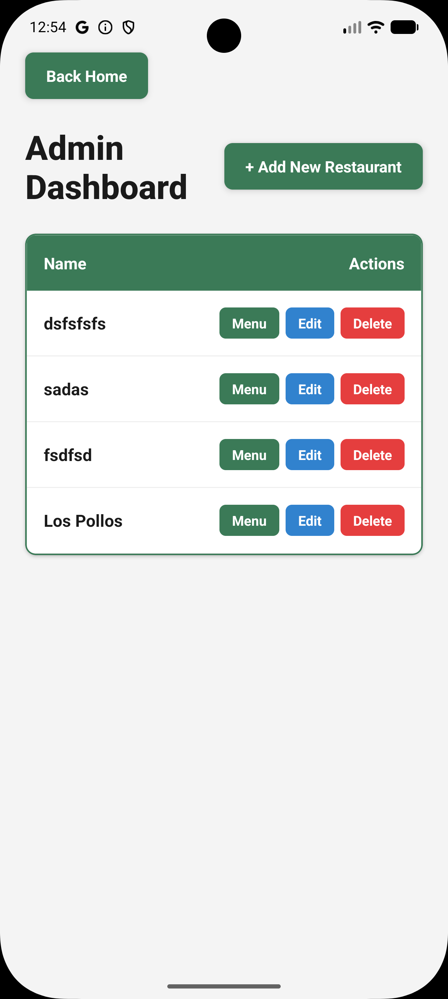

- Creating a Restaurant
    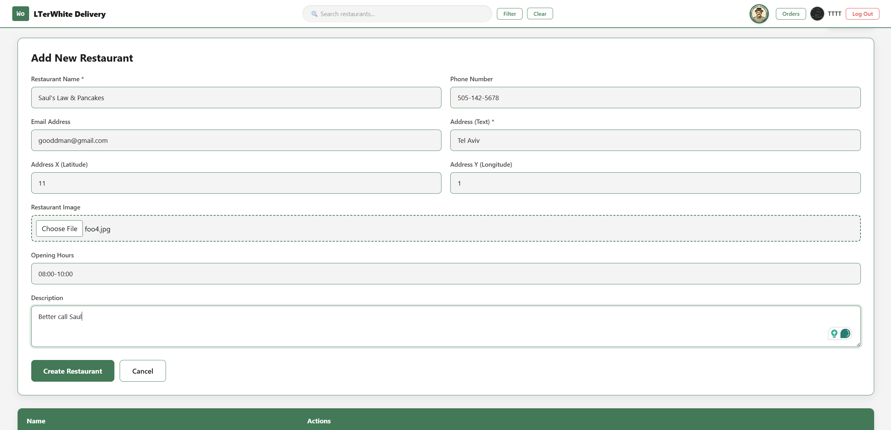

- Restaurant Created
    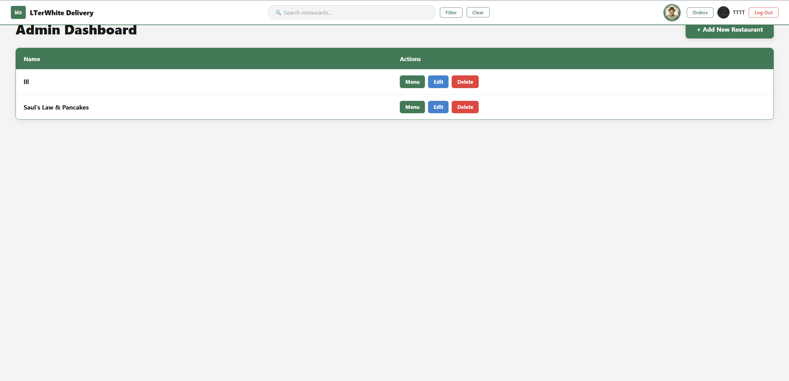

- Creating a Product
    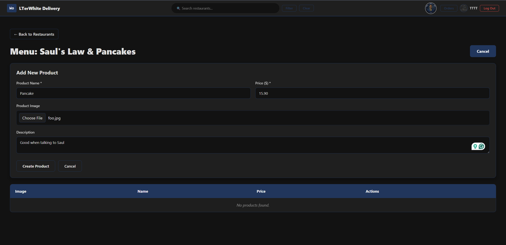

- Search & Filter
    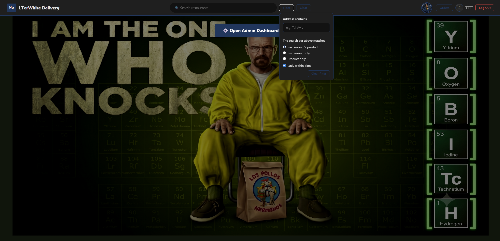

- Home Page with Restaurants
    

- Restaurant Page
    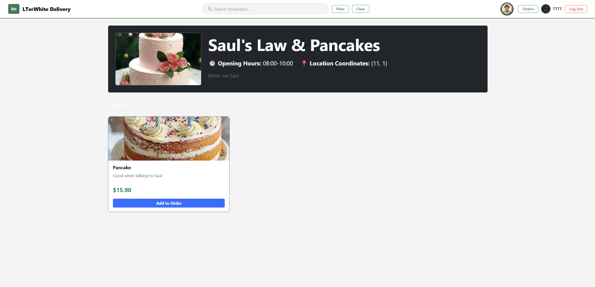

- Order Page
    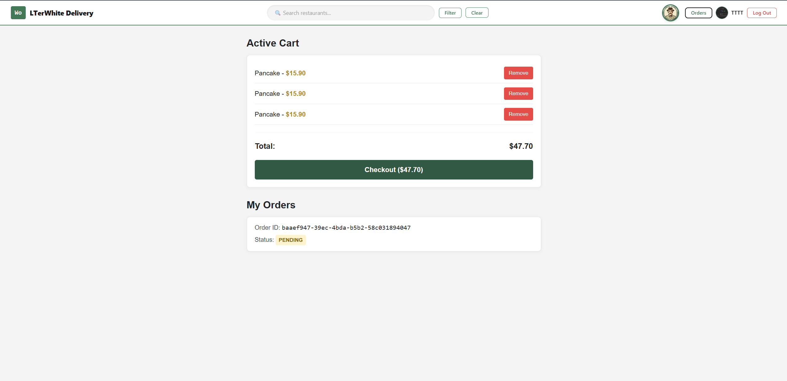

- Orders History
    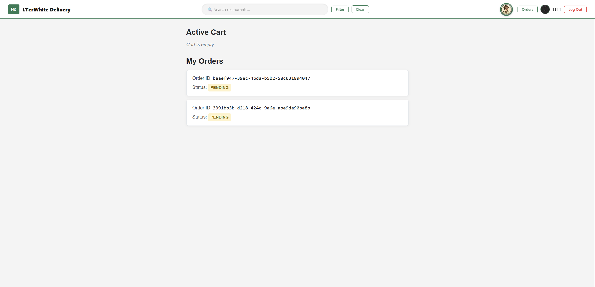

- Quick View
    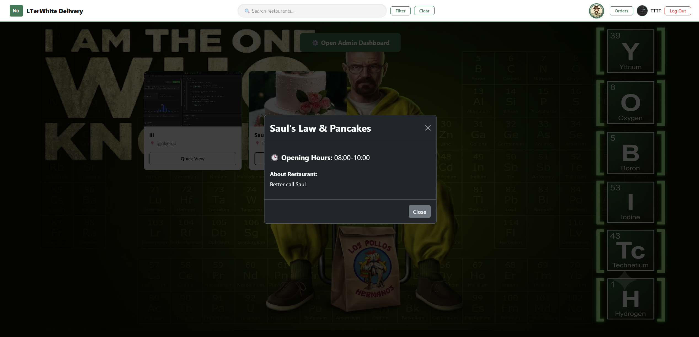

- Regular User Login
    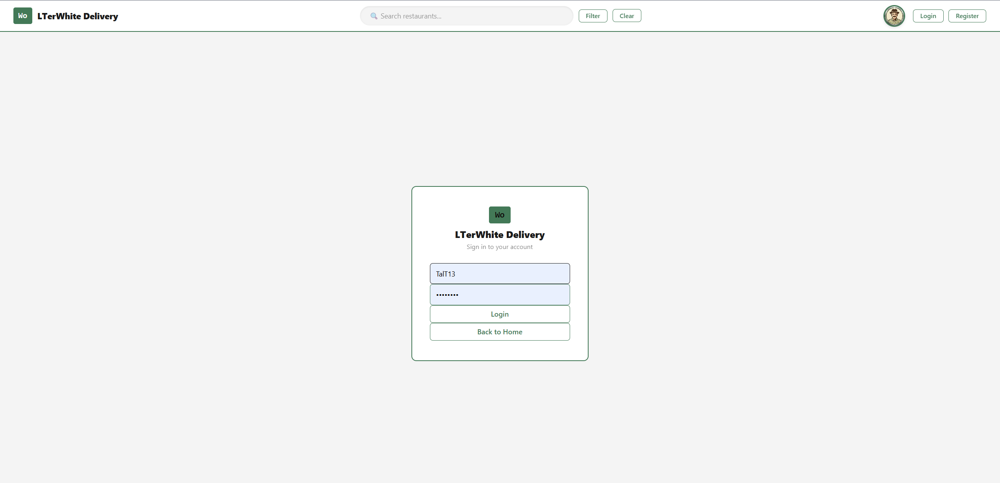

- Regular User Home
    

- Docker Up & Down
    
    

---

## 📄 License

Developed as part of an Advanced Systems Programming course assignment.
