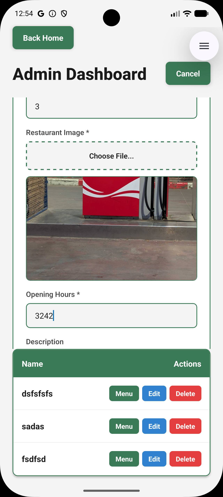
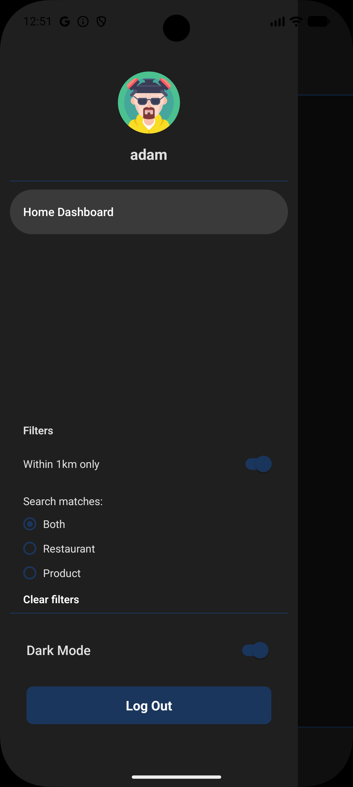
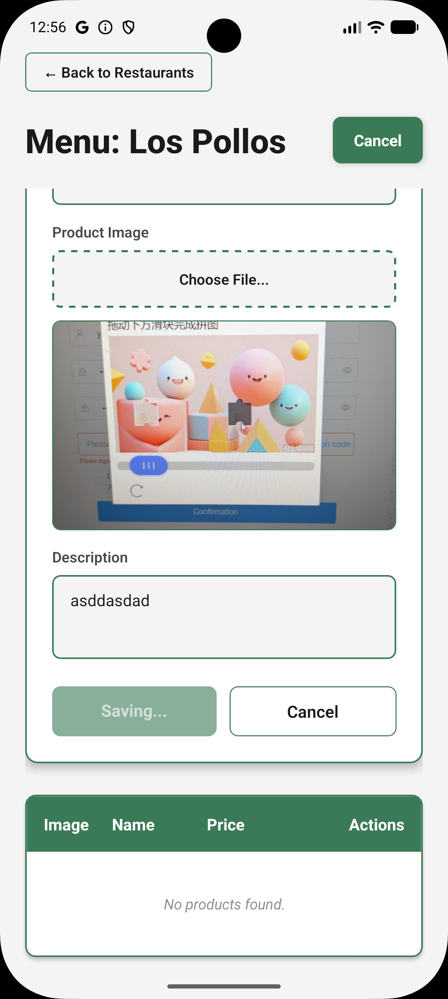
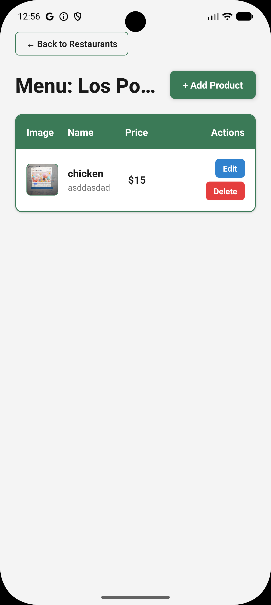
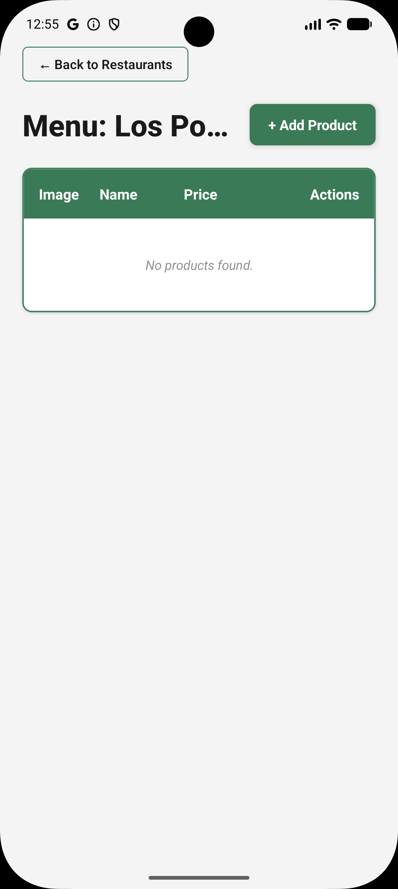
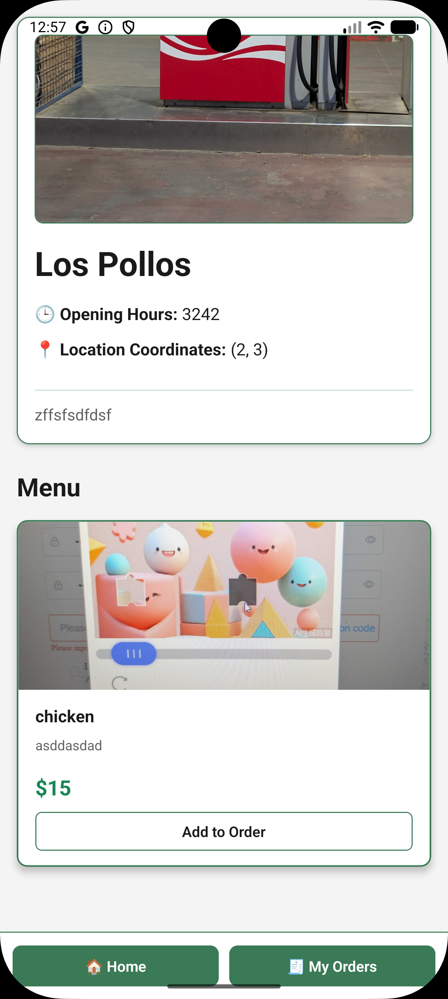
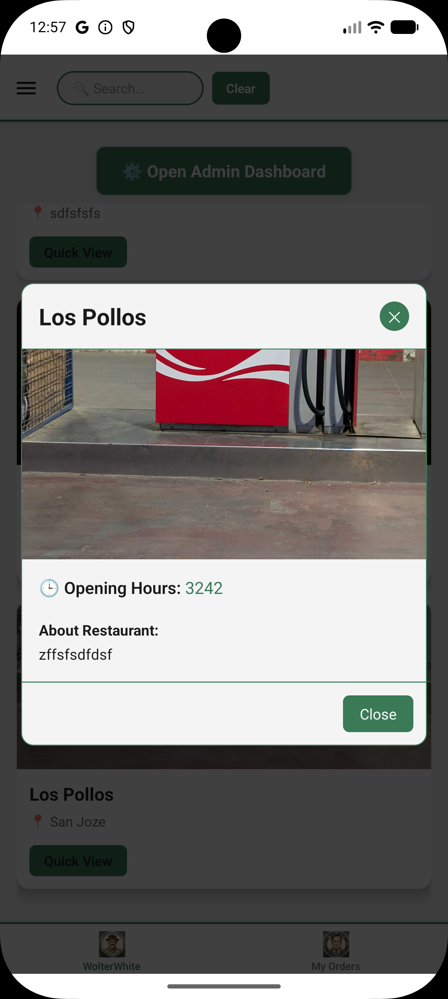

# 🍽️ CRUD Walkthrough — Restaurants, Products & Orders

Step-by-step verification of all create, edit, and delete operations across the **web dashboard** and the **React Native mobile app**. All operations require a valid login. Admin-only actions are marked.

---

## 🏪 Restaurants

### Create a Restaurant *(Admin only)*

**Web:**

1. Log in as admin (username must be admin1 and only after you registered one).
2. Click the **Admin Panel** button on the home dashboard.
3. Fill in the restaurant name and any other details.
4. Click **Create**. The new card appears on the home page.

**Mobile:**

1. Log in as admin.
2. On the **Home tab**, tap the **Admin** button.
3. Fill in the restaurant details and tap **Create**.

---

### View Restaurants

**Web:** All restaurants are displayed as cards on the home page after removing the filter (1km). Use the **search bar** in the header to filter by name.

**Mobile:** Restaurants appear as cards on the **Home tab** only after removing te filter in the side bar (1km). Scroll to browse.

---

### Edit a Restaurant *(Admin only)*

**Web:**

1. Go to the Admin Page - Find the restaurante.
2. Click the **Edit** button on the card.
3. Update the fields and click **Save**.

**Mobile:**

1. Go to the Admin Page - Find the restaurant.
2. Tap the **Edit** option.
3. Update the fields and confirm.

---

### Delete a Restaurant *(Admin only)*

**Web:** Go to the Admin Page - Click the **Delete** button on the restaurant and confirm. The card disappears from the dashboard.

**Mobile:** Go to the Admin Page - Click the **Delete** button on the restaurant and confirm. The card disappears from the home screen.

---

## 🛍️ Products

### Add a Product *(Admin only)*

**Web:**

1. Go to the Admin Page - Click a restaurant card to open its detail page.
2. Click **Add Product**.
3. Enter the product name, price and all the other fields , then click **Save**.

**Mobile:**

1. Go to the Admin Page - Tap a restaurant card to open its detail screen.
2. Tap **Add Product** (admins only).
3. Fill in the details and confirm.

---

### Delete a Product *(Admin only)*

**Web:** Go to the Admin Page - On the restaurant page, click the **Delete** icon next to the product.

**Mobile:** Go to the Admin Page - On the restaurant screen, tap **Delete** next to the product (admins only).

---

## 📦 Orders

### Place an Order

**Web:**

1. Open a restaurant's page.
2. Click **Add to Cart** on one or more products.
3. Navigate to **Orders** in the navbar.
4. Review your active cart and click **Checkout**.
5. A success message confirms the order and the cart clears.

**Mobile:**

1. Tap a restaurant card to open its screen.
2. Tap **Add to Cart** on products.
3. Navigate to the **My Orders tab** (bottom tab bar).
4. Review your cart and tap **Checkout**.
5. An alert confirms the order and the cart clears.

> ⚠️ Adding items from a **different restaurant** while a cart is active will replace the current cart with the new restaurant's items.

---

### View Order History

**Web:** On the **Orders page**, scroll below the active cart to see all past orders with their ID and status.

**Mobile:** The **My Orders tab** shows the active cart at the top and all past orders below it, each showing order ID and status.

---

## 📋 Full Operations Summary

| Operation | Role | Web | Mobile | Method | Endpoint |
| ----------- | ------ | ----- | -------- | -------- | ---------- |
| View restaurants | All | ✅ | ✅ | GET | `/api/restaurants` |
| Create restaurant | Admin | ✅ | ✅ | POST | `/api/restaurants` |
| Edit restaurant | Admin | ✅ | ✅ | PATCH | `/api/restaurants/:id` |
| Delete restaurant | Admin | ✅ | ✅ | DELETE | `/api/restaurants/:id` |
| Create product | Admin | ✅ | ✅ | POST | `/api/restaurants/:id/products` |
| Delete product | Admin | ✅ | ✅ | DELETE | `/api/restaurants/:id/products/:pid` |
| Place order | All | ✅ | ✅ | POST | `/api/orders` |
| View orders | All | ✅ | ✅ | GET | `/api/orders` |
