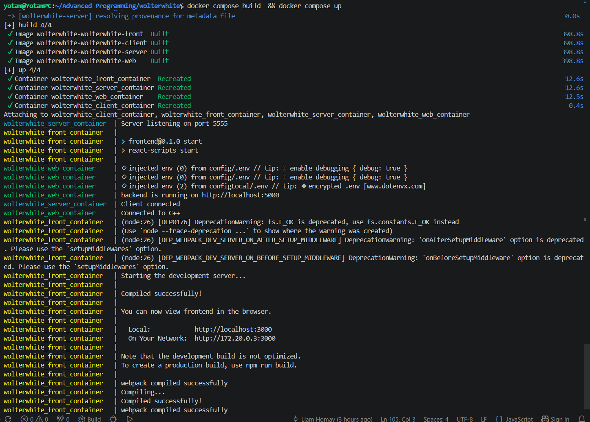
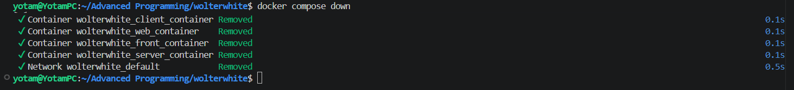

# 🌐 Environment Startup

This page explains how to bring up every tier of the WOLTerWhite system: the **C++ engine**, the **Node.js API**, the **React web app**, and the **React Native mobile app**.

---

## Prerequisites

| Tool | Purpose |
| ------ | -------- |
| Docker Desktop | Runs the backend, C++ engine, and web frontend |
| Node.js 18+ | Required for the mobile app only |
| Android Studio + Emulator | Running the mobile app |

---

## Step 1 — Start the Backend + Web (Docker)

```bash
git clone https://github.com/TalTikho/wolterwhite
cd wolterwhite
docker-compose up --build
```



You should see the WOLTerWhite web login page at `http://localhost:3000`.

To stop:

```bash
# Ctrl+C in the terminal, then:
docker-compose down
```



---

## Step 2 — Start the Mobile App (Android Emulator)

> 💡 **Why not Docker for mobile?** The Android emulator communicates with the Metro bundler via the special address `10.0.2.2`, which maps to the host machine. If Metro runs inside a Docker container, the emulator cannot reach it without complex ADB port forwarding. The mobile app is therefore intentionally run directly on the host.

### 2a - Create the API config file

This file is excluded from the repository via `.gitignore` and **must be created manually** before running the app. Without it, the app cannot connect to the backend and will fail to start.

Create the file at `mobile/services/apiConfig.ts`:

```typescript
import { Platform } from 'react-native';

export const API_BASE_URL = Platform.select({
  android: 'http://10.0.2.2:5000',
  ios: 'http://localhost:5000',
  default: 'http://localhost:5000',
});
```

### 2b - Install dependencies and launch

Open a new terminal (keep Docker running in the other one):

```bash
cd mobile
npm install
npx expo start -c --tunnel
```

> ⚠️ Note that you opened your emulator and it should be running beforehand. Press `a` in the Expo CLI to open the Android emulator, or scan the QR code with Expo Go on a physical device.

---

## Hybrid Mode (Optional — for Frontend Development)

If you want hot-reload on the web frontend without rebuilding containers:

**Terminal 1:**

```bash
docker compose up --build wolterwhite-server wolterwhite-web
```

**Terminal 2:**

```bash
cd frontend
npm install
npm start
```

> The web dashboard portal launches at `http://localhost:3000`

---
