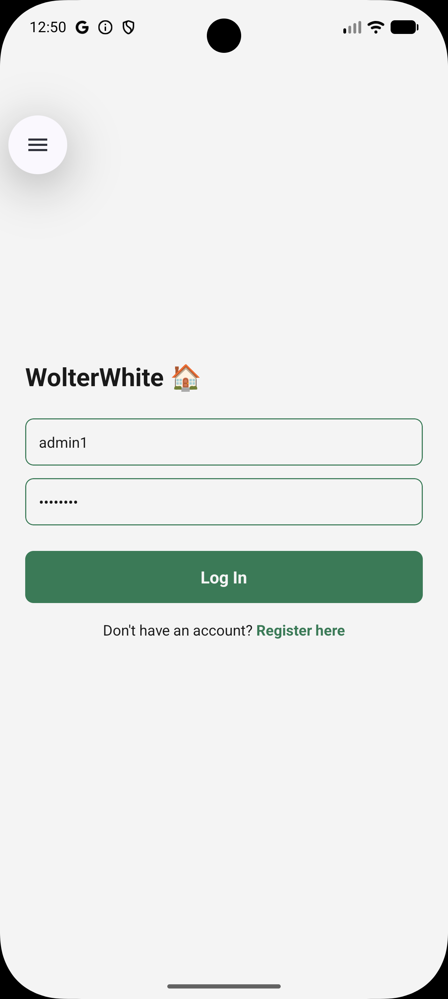
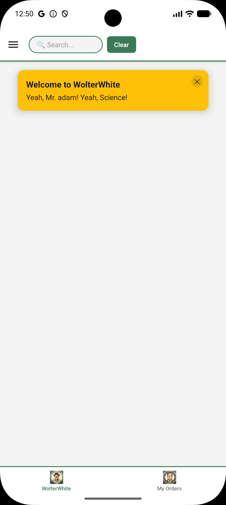

# 🔐 Login & Registration Flow

This page covers the full authentication flow across the **web dashboard** and the **React Native mobile app**.

---

## How Authentication Works

WOLTerWhite uses **JWT (JSON Web Token)** authentication across all clients:

1. User submits credentials → server validates → returns a signed JWT.
2. The client stores the token (web: React Context | mobile: AsyncStorage).
3. Every subsequent API request includes `Authorization: Bearer <token>`.
4. On a `401 Unauthorized` response, the token is cleared and the user is redirected to login automatically.

> ⚠️ Notice the token is saved for one hour only

---

## Default Credentials

| Role            | Username | Password   |
| --------------- | -------- | ---------- |
| Admin           | `admin1` | `Admin123!`|
| Regular User    | `user1`  | `User123!` |

> ⚠️ These are the defaults you should register before a login. If your instance has different credentials, register a new account using the registration flow below.

---

## Web — Login

1. Navigate to `http://localhost:3000` — you are redirected to the login page automatically.
2. Enter your username and password and click **Login**.
3. On success you land on the **Home Dashboard** with a welcome toast notification.
4. Your role controls which UI elements are visible.

## Web — Registration

1. On the login page, click **Register**.
2. Fill in a unique username and password, then click **Register**.
3. On success you are automatically logged in and redirected to the home page.

## Web — Logout

Click the logout button in the navbar or side menu. The token is cleared from React Context and you are redirected to `/login`.

---

## Mobile — Login

1. Launch the app in the Android emulator (see [Environment Startup](environment-startup.md)).
2. The app opens on the **Login screen**.
3. Enter your credentials and tap **Login**.
4. On success you are navigated to the **Home tab** inside the drawer/tab navigator.
5. The JWT is saved to AsyncStorage and reused across app restarts.

## Mobile — Registration

1. On the login screen, tap **Register**.
2. Enter a unique username and password, then tap **Register**.
3. On success you are automatically logged in and taken to the home screen.

## Mobile — Logout

Open the **side drawer** (swipe right or tap the hamburger icon) and tap **Logout**. The token is removed from AsyncStorage and the app resets to the login screen.

---

## Admin vs Regular User

| Feature | Admin | Regular User |
| --------- | ------- | -------------- |
| View restaurants | ✅ | ✅ |
| Browse products | ✅ | ✅ |
| Place orders | ✅ | ✅ |
| View order history | ✅ | ✅ |
| Create restaurant | ✅ | ❌ |
| Edit restaurant | ✅ | ❌ |
| Delete restaurant | ✅ | ❌ |
| Add product to restaurant | ✅ | ❌ |
| Delete product | ✅ | ❌ |
| Access admin panel | ✅ | ❌ |

---
